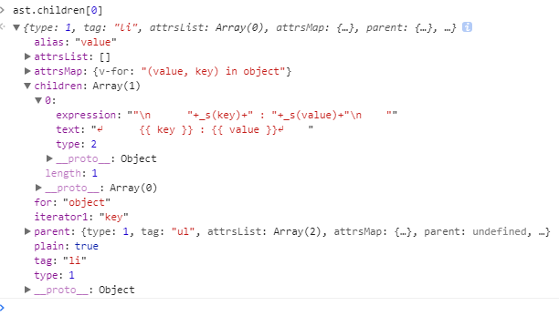

# v-if v-for

	HTML:
	<div id="app">
	  <h1 v-if="ok">Yes</h1>
	  <h1 v-else>No</h1>
	</div>

	js:
	let app = new Vue({
	  el: '#app',
	  data: {
	    ok: true
	  }
	})

在parsenode是会给有v-if的节点添加ifConditions属性, 该属性的值是一个数组, 分别存储if-else的每个分支, 每个数组元素都是对象, 有2个属性, exp: 用于判断是否显示, block该代码块的parse的值

在markStatic时会循环判断每个block是否是静态节点, 来标记父节点

	  function markStatic (node: ASTNode) {
	 	...

	    if (node.ifConditions) {
	      for (let i = 1, l = node.ifConditions.length; i < l; i++) {
	        const block = node.ifConditions[i].block
	        markStatic(block)
	        if (!block.static) {
	          node.static = false
	        }
	      }
		}
	  }

render函数长这样
```_c('div',{attrs:{"id":"app"}},[(ok)?_c('h1',[_v("Yes")])
    :_c('h1',[_v("No")])])```

后边就和之前一样了, 通过watcher收集依赖判断data.ok改变时重新渲染

>v-if 是“真正的”条件渲染，因为它会确保在切换过程中条件块内的事件监听器和子组件适当地被销毁和重建。

>v-if 也是惰性的：如果在初始渲染时条件为假，则什么也不做——直到条件第一次变为真时，才会开始渲染条件块。


---

# v-for 对象迭代
示例

	HTML:
	<div id="app">
	 <ul id="repeat-object" class="demo">
	    <li v-for="(value, key) in object">
	      {{ key }} : {{ value }}
	    </li>
	  </ul>
	</div>

	js:
	let app = new Vue({
	  el: '#repeat-object',
	  data: {
	    object: {
	      firstName: 'John',
	      lastName: 'Doe',
	      age: 30
	    }
	  }
	})

parse后会将app的子节点变为这样

